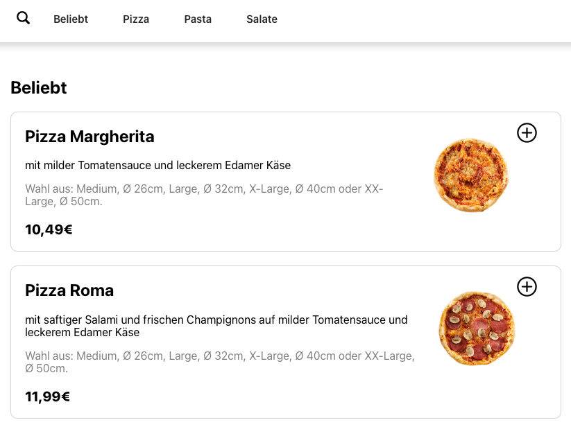
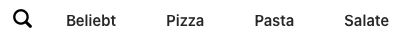
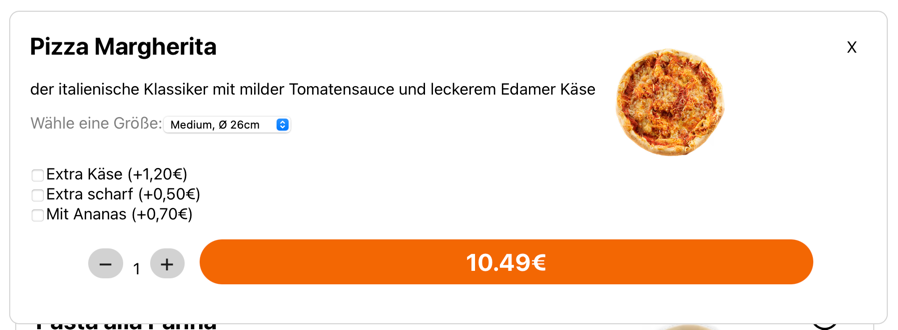
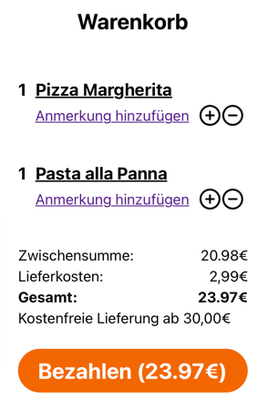
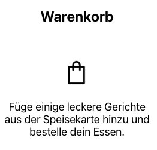

# Hdm React Lecture

This repository contains exercises for practicing the stuff you learned during our lecture. You will transform a static html website to a dynamic, component based website using react.

## Installation

To follow along, please complete these steps:

1. Install node.js: https://nodejs.org/en/download
2. Open a terminal and cd into the directory of this repository
3. Run `npm install` to get all the dependencies
4. Run `npm start` to start the webserver

Then your default browser should open this address: `localhost:3000` and display a website.
If not, try to open this website manually.

# Exercises
## Exercise 1 / Components

Your task is to replace the static food list with some react components. At the end you should have seperate FoodItem components for the dishes inside a category which are displayed inside a FoodList. Also, every category from 'Beliebt, Pizza, Pasta, Salate' should be button component.



You need to create:
- FoodList (the whole area with all the food entries)
- FoodItem (a single food entry)
- FoodButton (the food category buttons)

Use the data from [here](./exersice-resources/allFood.js) inside the foodList as data input.
Choose your favourite food category from the object which you want to display. This is important for the `.map()` function.

If you need a key for a list item, you can use `key={uuidv4()}`. The uuid package should be already installed. Import it like this: `import { v4 as uuidv4 } from 'uuid';`

Get some [hints](#exercise-1-hints).

## Exercise 2 / States

Now we want to bring some life to the food category section.



Your task is to make the FoodButtons work. Add them to app.js, use states to store the selected category and have the foodList updated accordingly.

Get some [hints](#exercise-2-hints).

## Exercise 3 / Modal & Cart
### Modal



Let's add some functionality to our foodItems. Your goal is to implement a modal which pops up, if you click on the 'plus' icon. There you can set how many pizzas you want and can choose some more options.
After that, you should implement the cart functionality. If you add a dish in the modal, it should pop up inside the cart.

Use states to set the open/close status of the modal and to store which foodItem was clicked.
The modal can be placed inside foodList, but you need to update the foodItem to get some data for the modal.

### Cart



You need to propagete the modal data to the data to our cart component.
One approach could be to store the cart items inside a state in the app component, which then feeds the cart.
You could store the user input data from the modal in an object like this `{"title": food.title, "price": total, "counter": counter}` and propagate it up.

You can find our premade modal component and it's stylesheet [here](./exersice-resources/Components).

Cart components [here](./exersice-resources/Components/Cart). The cart component is made up out of a CartItem and a CartSummary.

Get some [hints](#exercise-3-hints).

## Exercise 4 / Conditionals


Now we want to render content based on a condition. You need to modify the cart so that it displays [this](./exersice-resources/cart-conditional-if-else.js), if no items are inside the cart.
Also add a if/else ternary expression inside CartSummary which adds the following text

`Kostenfreie Lieferung ab 30€`

if the total matches the condition.



Import the cart icon like this `import {HiOutlineShoppingBag} from "react-icons/hi";`

Get some [hints](#exercise-4-hints).

## Exercise 5 / useEffect-Hook


As you remember from last time, we created an application for placing food orders. Our application now has a modal as well as a cart for your orders.
When looking at our modal by clicking on a 'plus' icon of a food item, you can see that selecting the size and adding some more ingredients to the dish is changing the price shown on the bottom. If you try to increase the quantity, the price won’t change.

Take a closer look at the functions connected to the buttons for changing the quantity [here](./src/Components/Modal.js) and think of a way to solve the problem by using the useEffect-Hook!

Get some [hints](#exercise-5-hints)

## Exercise 6 / Redux

Outsource the storage of the category to be displayed (Popular, Pizza, Pasta, Salads) to a global store using Redux. 


The global store is already initialized in index.js. In the Action component (Actions/index.js) you still have to add the cases for Pasta and Salads.
In App.js you should now access the state. In FoodButton.js you should use Dispatch to write the new state to the store.

Get some [hints](#exercise-6-hints).

## Exercise 7 / Tests

Now we want to implement some tests for our component. For that, please replace the variable assignment of `allFood` (found [here](./src/Components/Food/FoodList.js), Line 8) with the fake API call function:
```
import {fetchFood} from "../../utils/foodAPI";
allFood = fetchFood()
```


Have a look at the syntax for the test. You can find more information [here](https://jestjs.io/docs/tutorial-react#dom-testing). 
```
describe('Suit name', () => {
    test("Test name", () => {
        render(<mycomponent/>);
        const someElement = screen.getByText(/someText/i);
        expect(someElement).toBeInTheDocument();
    });
```
Please create a FoodList.test.js file and write 3 tests in 2 test suites:

### Suite 1 ("Correct items in foodList")
1. Check if 'Pizza Margretha' gets rendered, if the FoodList is set to the 'beliebt' category.
2. Write a parameterized test for the following input and output (read the [docs](https://jestjs.io/docs/api#testeachtablename-fn-timeout)):

```
[['beliebt', 'Pizza Margherita'],
['beliebt', 'Pasta alla Panna'],
['pizza', 'Pizza Roma'],
['salate', 'Gemischter Salat']]
```

### Suite 2 ("API call test")
1. Mock the fetchFood call and set this return value for it. Also in the same test use a click event to open the modal and check if it has opened. You can find the mock function, and it's import [here](./exersice-resources/mock-function.js).

Run the test with `npm test`
Get some [hints](#exercise-7-hints).

# Hints
## Exercise 1 Hints
1. Create the 3 components in a 'Components' folder.
2. Create a FoodButton component which returns a `<button>` and replace the static html with a JSX element to generate a button for every category. You can do that with a `.map()` function.
3. Create a FoodItem which uses props to display the title, description, size, image and price of a dish.
4. Create a FoodList component and add the food data object from [here](./exersice-resources/allFood.js) to it. Add another `.map()` function which returns a FoodItem, for e.g. `allfood.beliebt.map(...)`

## Exercise 2 Hints
1. Add a 'category' state to store the selected category.
2. Add the function 'setCategory' to the FoodButton so that you can implement an event inside the FoodButton component and call this function.

## Exercise 3 Hints
### Modal
1. Create the components and import them into the foodList.
2. Create states inside foodList to store the open/close status and the clickedItem for the modal.
3. Implement a function to set the allFoods object to the selectd category (slice the array)
4. Add a function to set openModal to true/false
5. Add the two functions you just created to the foodItem attributes so that you can call them inside foodItem
6. Call the functions with `onClick` inside the foodItem
7. You can use the `clicedItem` state to insert the modal in FoodList with a conditional. Maybe don't render it, if nothing was clicked.

### Cart
1. Add a cartItems state inside the app component with a empty list as an initial state.
2. Add a function to append an item to that list. You can use the `...cartItems`` notation to unpack items from a list.
3. Propagate this function down inside foodList and then inside the modal.
4. Call it there and add some data to the cartItems state.
5. Set the cartItems as an attribute for the cart component to propagate the state down into the cart.

## Exercise 4 Hints
1. For the full/empty cart make an if/else statement and return either the CartItem component if the cart as some items or return the empty-cart-message from [here](./exersice-resources/cart-conditional-if-else.js).
2. The solution for the ternary expression can be found [here](./exersice-resources/cart-conditional-ternary.js)

## Exercise 5 Hints
1. To use the useEffect-Hook, we need to take a look at which function we want to execute in order to calculate the new price as well as the prop/state that it should depend on. For that, look at the state that changes when using the functions `countdown()` and `countup()`

## Exercise 6 Hints
1. For the syntax of the salad and pasta cases you can use the syntax of the cases for pizza and popular. 
2. The new state can be accessed with `useSelector()`.
3. So that the new state is accessed on every update, useEffect() can be useful.
4. `Dispatch(action)` passes action function to store. 
5. A category can be given to the action..

## Exercise 7 Hints
1. Read the documentation pages, there you should find everything.
